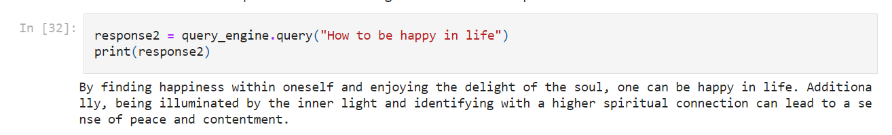
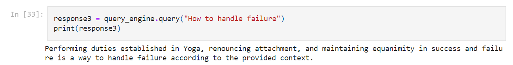

# Bhagavad Gita Chatbot with LLamaIndex

## Overview

This project involves creating a Bhagavad Gita Chatbot utilizing the LLamaIndex framework for efficient information retrieval. The Chatbot is designed to respond intelligently to user queries about Bhagavad Gita teachings.





## Installation

Ensure you have the required dependencies installed by running:

```bash
pip install llama-index openai python-dotenv pypdf
```

## Configuration
Install the necessary packages using the provided requirements file.
Create a .env file and set your LLM API key:

```bash
echo "OPENAI_API_KEY=your_openai_api_key" > .env
```
## Or you can download an open source LLM and deploy the code for it.


## Usage

Load the Bhagavad Gita text data from the "Source" directory.
Convert the document into a LLamaIndex for efficient querying.
Utilize the query engine to retrieve relevant information based on user queries.

```bash
python your_script_name.py
```

## Contributing

Contributions are welcome! Please follow the standard GitHub workflow:

Fork the repository.
Create a new branch for your feature or bug fix.
Make changes and commit them.
Push your branch and open a pull request.

